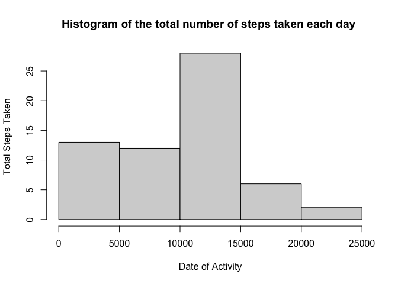
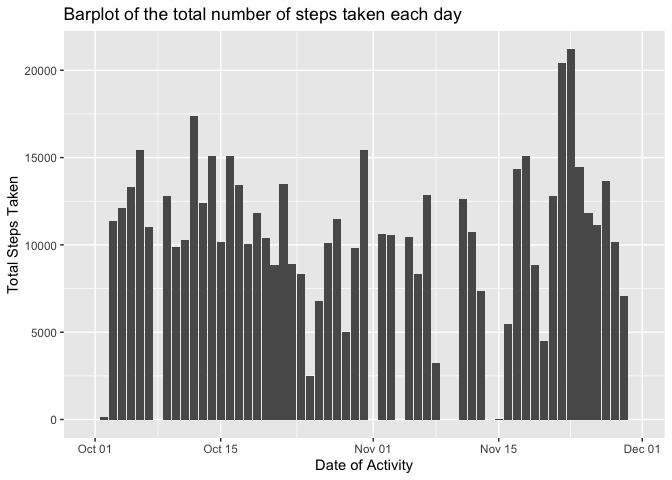
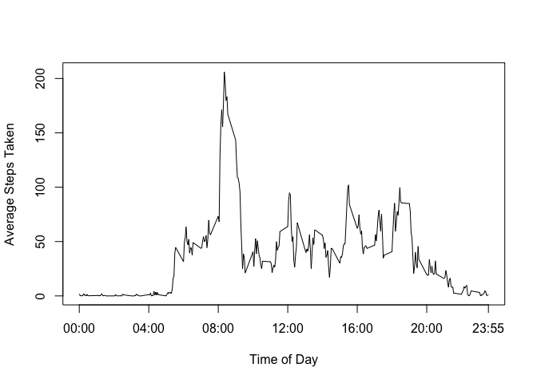
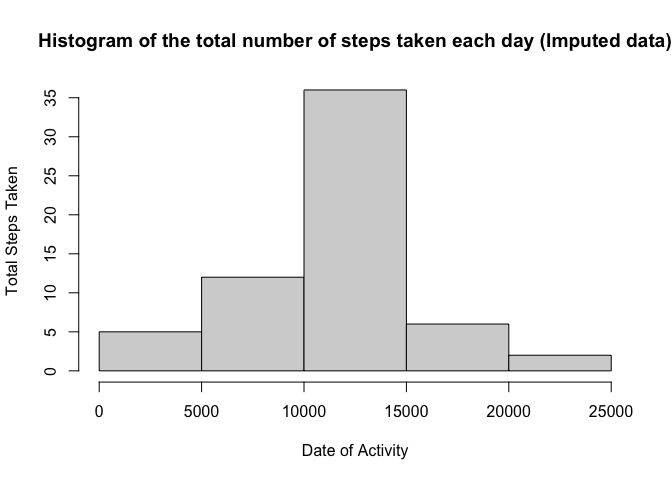
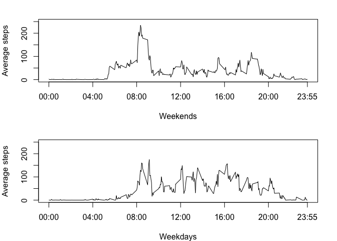

## Loading and preprocessing the data


```r
library(readr)
library(dplyr)
library(ggplot2)
options(scipen = 999)
activity <- read_csv("activity.csv")

changeIntervalToTime <- function(interval){
  format(strptime(substr(as.POSIXct(sprintf("%04.0f", interval), format= "%H%M"), 12,16), '%H:%M'), '%I:%M %p')
}
activity <- mutate(activity, time = changeIntervalToTime(interval))

activity$dayType <- ifelse(weekdays(activity$date, abbreviate = TRUE) %in% c("Sat", "Sun"), "weekends", "weekdays") 
```

After preprocessing state, the activity data (the first 6 row of data) looks like below:


```
## # A tibble: 6 × 5
##   steps date       interval time     dayType 
##   <dbl> <date>        <dbl> <chr>    <chr>   
## 1    NA 2012-10-01        0 12:00 AM weekdays
## 2    NA 2012-10-01        5 12:05 AM weekdays
## 3    NA 2012-10-01       10 12:10 AM weekdays
## 4    NA 2012-10-01       15 12:15 AM weekdays
## 5    NA 2012-10-01       20 12:20 AM weekdays
## 6    NA 2012-10-01       25 12:25 AM weekdays
```

## What is mean total number of steps taken per day?

1. Calculate the total number of steps taken per day

```r
stepsPerDay <- summarize(activity, totalSteps = sum(steps, na.rm = TRUE), .by = date )
```
2. Make a histogram of the total number of steps taken each day 

Histogram of the total number of steps taken each day 


```r
hist(stepsPerDay$totalSteps, xlab = "Date of Activity", ylab = "Total Steps Taken", main = "Histogram of the total number of steps taken each day ")
```

<!-- -->

Barplot of the total number of steps taken each day


```r
p <- ggplot(stepsPerDay, aes(x=date, y=totalSteps)) + geom_bar(stat = "identity") + labs(x = "Date of Activity", y = "Total Steps Taken", title = "Barplot of the total number of steps taken each day")
print(p)
```

<!-- -->

3. Calculate and report the mean and median of the total number of steps taken per day

```r
meanSteps <- ceiling(mean(stepsPerDay$totalSteps))
medianSteps <- ceiling(median(stepsPerDay$totalSteps))
```
The mean of the total number of steps per day is 9355.
The mean of the total number of steps per day is 10395.

## What is the average daily activity pattern?

1.Make a time series plot (i.e. type = "l") of the 5-minute interval (x-axis) and the average number of steps taken, averaged across all days (y-axis)


```r
fiveMinuteInterval <- summarize(activity, averageSteps = mean(steps, na.rm = TRUE), .by = interval )
fiveMinuteInterval <- mutate(fiveMinuteInterval, time = changeIntervalToTime(interval))

with(fiveMinuteInterval, plot(interval, averageSteps, type = "l", xaxt = "n", xlab = "Time of Day", ylab = "Average Steps Taken"))
axis(1, labels = c("00:00", "04:00", "08:00","12:00", "16:00", "20:00", "23:55"), at = c(0,400, 800, 1200, 1600, 2000, 2355))
```

<!-- -->

2. On average across all the days in the dataset, time interval between 7:45 AM to 8:10 AM contains the maximum number of steps.

## Imputing missing values

1. Calculate and report the total number of missing values in the dataset (i.e. the total number of rows with NAs)


```r
naCount <- sum(is.na(activity$steps))
```

The total number of missing values in the dataset is 2304.

3. Create a new dataset that is equal to the original dataset but with the missing data filled in.

```r
imputingData <- activity

for(i in 1:nrow(imputingData)){
  if(is.na(imputingData[i,]$steps)) {
    imputingItem <- imputingData[i, ]
    intervalItem <- subset(fiveMinuteInterval, interval == imputingItem$interval)
    imputingData[i,]$steps <- intervalItem$averageSteps
  }
}
```

The imputed data (the first 6 row of data) looks like below:


```
## # A tibble: 6 × 5
##    steps date       interval time     dayType 
##    <dbl> <date>        <dbl> <chr>    <chr>   
## 1 1.72   2012-10-01        0 12:00 AM weekdays
## 2 0.340  2012-10-01        5 12:05 AM weekdays
## 3 0.132  2012-10-01       10 12:10 AM weekdays
## 4 0.151  2012-10-01       15 12:15 AM weekdays
## 5 0.0755 2012-10-01       20 12:20 AM weekdays
## 6 2.09   2012-10-01       25 12:25 AM weekdays
```

4. Make a histogram of the total number of steps taken each day and Calculate and report the mean and median total number of steps taken per day.


```r
filledDataStepsPerDay <- summarize(imputingData, totalSteps = sum(steps, na.rm = TRUE), .by = date )

hist(filledDataStepsPerDay$totalSteps, xlab = "Date of Activity", ylab = "Total Steps Taken", main = "Histogram of the total number of steps taken each day (Imputed data)")
```

<!-- -->


```r
meanStepsFilled <- ceiling(mean(filledDataStepsPerDay$totalSteps))
medianStepsFilled <- ceiling(median(filledDataStepsPerDay$totalSteps))
```
The mean of the total number of steps per day is 10767.
The median of the total number of steps per day is 10767.


## Are there differences in activity patterns between weekdays and weekends?

1. Create a new factor variable in the dataset with two levels – “weekday” and “weekend” indicating whether a given date is a weekday or weekend day.


```r
activity$dayType <- ifelse(weekdays(activity$date, abbreviate = TRUE) %in% c("Sat", "Sun"), "weekends", "weekdays") 
activity$dayType <- as.factor(activity$dayType)

weekends <- subset(activity, activity$dayType == "weekends")
weekdays <- subset(activity, activity$dayType == "weekdays")
```

2. Make a panel plot containing a time series plot (i.e.type = "l") of the 5-minute interval (x-axis) and the average number of steps taken, averaged across all weekday days or weekend days (y-axis). 


```r
weekdaysfiveMinuteInterval <- summarize(weekdays, averageSteps = mean(steps, na.rm = TRUE), .by = interval )
weekendsfiveMinuteInterval <- summarize(weekends, averageSteps = mean(steps, na.rm = TRUE), .by = interval )
par(mar = c(4,4,2,2), mfrow= c(2,1))
with(weekdaysfiveMinuteInterval, plot(interval, averageSteps, type = "l", xaxt = "n", xlab = "Weekends", ylab = "Average steps", ylim = c(0, 250)))
axis(1, labels = c("00:00", "04:00", "08:00","12:00", "16:00", "20:00", "23:55"), at = c(0,400, 800, 1200, 1600, 2000, 2355))
with(weekendsfiveMinuteInterval, plot(interval, averageSteps, type = "l", xaxt = "n", xlab = "Weekdays", ylab = "Average steps", ylim = c(0, 250)))
axis(1, labels = c("00:00", "04:00", "08:00","12:00", "16:00", "20:00", "23:55"), at = c(0,400, 800, 1200, 1600, 2000, 2355))
```

<!-- -->
